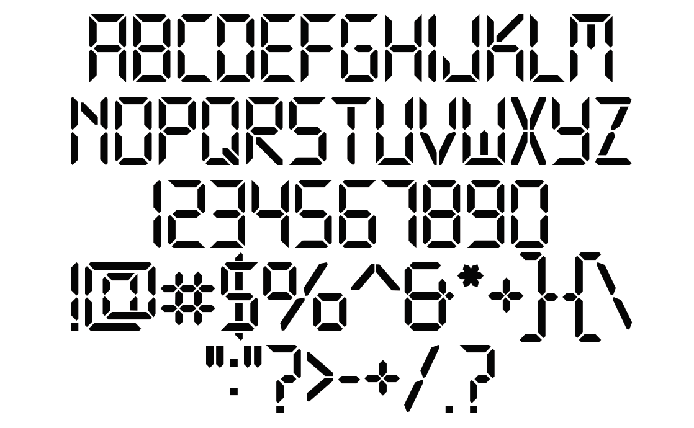

# Technology

Technology is the application of conceptual knowledge to achieve practical goals, especially in a reproducible way. The word technology can also mean the products resulting from such efforts, including both tangible tools such as utensils or machines, and intangible ones such as software.

## Variable Font Axe

Technology has the following axe:

  Tag | Default | Static Instances
--- | --- | ---
  wght | 400 | Regular

## License

This Font Software is licensed under the SIL Open Font License, Version 1.1.
This license is available with a FAQ at [https://openfontlicense.org](https://openfontlicense.org)
